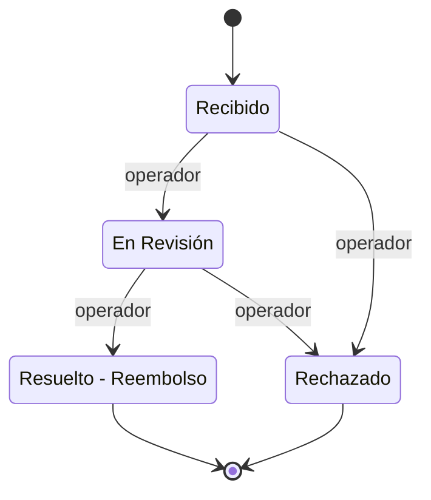

# Módulo de Gestión de Reclamos por Incidencias en Envíos

Portal fullstack para que un cliente registre un reclamo asociado a su número de guía y le dé seguimiento con un **folio**, mientras un **operador** interno actualiza el estado y agrega observaciones.

| Capa | Tecnología |
|------|------------|
| Frontend | React 19 + Vite + TypeScript (servido por nginx en Docker) |
| Backend | Node 20 + Express + TypeScript, validación con zod, JWT (HS256) |
| Base de datos | MySQL 8.4 (esquema y 6 reclamos de prueba precargados) |
| Documentación | Swagger UI (`/api/docs`) + colección Postman |
| Pruebas | Jest (27 pruebas unitarias y de API con supertest) |
| Despliegue | Docker / docker-compose |

## Inicio rápido (Docker)

Requisitos: Docker con Compose v2.

```bash
git clone https://github.com/oscar-sarceno/prueba-almo.git
cd prueba-almo
docker compose up --build
```

| Servicio | URL |
|----------|-----|
| Aplicación web | http://localhost:8080 |
| API | http://localhost:3000/api (también disponible como `http://localhost:8080/api`) |
| Swagger UI | http://localhost:3000/api/docs |

Para detener y borrar los datos: `docker compose down -v`.

> **Seguridad:** los valores por defecto de `JWT_SECRET` y `OPERADOR_PASSWORD` en `docker-compose.yml` son solo para demo local. Para cualquier otro entorno copia `.env.example` a `.env` y define los tuyos. Con `NODE_ENV=production` el backend se niega a arrancar si no están definidos.

## Desarrollo local (sin contenedores para la app)

Requisitos: Node ≥ 20 y Docker (solo para MySQL).

```bash
docker compose up -d db                 # MySQL con el seed en 127.0.0.1:3306
cp .env.example backend/.env            # variables del backend

cd backend && npm install && npm run dev    # API en http://localhost:3000
cd frontend && npm install && npm run dev   # Web en http://localhost:5173 (proxy /api → :3000)
```

Pruebas del backend: `cd backend && npm test` (con cobertura: `npx jest --coverage`).

## Cómo probar los 3 endpoints

Los ejemplos usan la API directa en `localhost:3000`.

### 1. `POST /api/reclamos` — registrar un reclamo (público)

```bash
curl -i -X POST http://localhost:3000/api/reclamos \
  -H "Content-Type: application/json" \
  -d '{
    "numeroGuia": "GU100000777",
    "tipoIncidencia": "Paquete Dañado",
    "descripcion": "La caja llegó aplastada y el producto interior está roto."
  }'
```

Responde `201 Created` con el folio único (`REC-YYYYMMDD-XXXXXX`) y el estado inicial `Recibido`.

Tipos de incidencia permitidos: `Paquete Dañado`, `Paquete Incompleto`, `No Recibido`. Cualquier otro valor → **400**. La descripción debe tener entre **20 y 500** caracteres → **400** con el detalle por campo:

```json
{ "error": "Los datos enviados no son válidos",
  "detalles": { "descripcion": "La descripción debe tener al menos 20 caracteres" } }
```

### 2. `GET /api/reclamos/{folio}` — consultar el estado (público)

```bash
curl http://localhost:3000/api/reclamos/REC-20260903-C3D4E5
```

Devuelve estado, fecha de creación, fecha de última actualización y el historial de observaciones en orden cronológico con fecha y hora:

```json
{
  "folio": "REC-20260903-C3D4E5",
  "numeroGuia": "GU100000003",
  "tipoIncidencia": "No Recibido",
  "descripcion": "Han pasado diez días desde la fecha estimada y el paquete no ha llegado.",
  "estado": "En Revisión",
  "fechaCreacion": "2026-09-03T17:30:00.000Z",
  "fechaActualizacion": "2026-09-08T09:45:00.000Z",
  "observaciones": [
    { "comentario": "Iniciamos la búsqueda del paquete con la sucursal de destino.", "autor": "operador", "fecha": "2026-09-04T10:30:00.000Z" }
  ]
}
```

Un folio que no existe (o con formato inválido) responde **404**:

```json
{ "error": "No encontramos un reclamo con el folio REC-20260101-000000. Verifica el folio e intenta de nuevo." }
```

### 3. `PATCH /api/reclamos/{folio}` — actualizar estado y agregar observación (operador)

Requiere un JWT con rol `operador` (ver siguiente sección).

```bash
curl -X PATCH http://localhost:3000/api/reclamos/REC-20260901-A1B2C3 \
  -H "Content-Type: application/json" \
  -H "Authorization: Bearer $TOKEN" \
  -d '{ "estado": "En Revisión", "observacion": "Iniciamos la revisión del daño." }'
```

- `observacion` es obligatoria (1–1000 caracteres); `estado` es opcional y debe ser uno de: `Recibido`, `En Revisión`, `Resuelto - Reembolso`, `Rechazado`.
- Actualiza la fecha de última actualización y agrega la observación con el usuario del token como autor.
- Un reclamo en estado final (`Resuelto - Reembolso` o `Rechazado`) ya no puede cambiar de estado (**409**), pero sí recibir observaciones.

| Código | Cuándo |
|--------|--------|
| 200 | Actualizado |
| 400 | Estado inválido u observación faltante/vacía |
| 401 | Sin token, token inválido o expirado |
| 403 | Token válido pero sin rol `operador` |
| 404 | Folio inexistente |
| 409 | Cambio de estado sobre un reclamo ya cerrado |

## Cómo generar y usar el token del operador

El token es un JWT (HS256, expira en 1 h) con `role: "operador"`. Hay tres formas de obtenerlo:

**a) Endpoint de login** (credenciales demo: `operador` / `operador123`, configurables con `OPERADOR_USER` y `OPERADOR_PASSWORD`):

```bash
TOKEN=$(curl -s -X POST http://localhost:3000/api/auth/token \
  -H "Content-Type: application/json" \
  -d '{"usuario":"operador","password":"operador123"}' | sed -E 's/.*"token":"([^"]+)".*/\1/')
echo $TOKEN
```

**b) Script** (usa el `JWT_SECRET` del entorno; desde `backend/`):

```bash
npm run token
```

**c) Swagger UI / Postman:** en `/api/docs` ejecuta `POST /api/auth/token`, pulsa **Authorize** y pega el token. La colección de Postman guarda `{{token}}` automáticamente al ejecutar *3. Login operador*.

Envíalo en cada petición protegida como `Authorization: Bearer <token>`. El login tiene rate limit (20 intentos / 15 min).

## Documentación de la API

- **Swagger UI:** http://localhost:3000/api/docs (spec en `/api/docs/openapi.json`, fuente en [`backend/docs/openapi.yaml`](backend/docs/openapi.yaml)).
- **Postman:** importa [`docs/postman_collection.json`](docs/postman_collection.json). Incluye el flujo completo con tests (crear → consultar → login → PATCH) y casos de error; usa las variables `baseUrl`, `folio` y `token`.

## Folios de prueba precargados

| Folio | Tipo | Estado | Observaciones |
|-------|------|--------|:---:|
| `REC-20260901-A1B2C3` | Paquete Dañado | Recibido | 0 |
| `REC-20260902-B2C3D4` | Paquete Incompleto | En Revisión | 2 |
| `REC-20260903-C3D4E5` | No Recibido | En Revisión | 3 |
| `REC-20260905-D4E5F6` | Paquete Dañado | Resuelto - Reembolso | 2 |
| `REC-20260908-E5F6A7` | No Recibido | Rechazado | 2 |
| `REC-20260910-F6A7B8` | Paquete Incompleto | Recibido | 0 |

El seed vive en [`db/init.sql`](db/init.sql) y se carga solo la primera vez que se crea el volumen de MySQL.

## Arquitectura

El backend separa responsabilidades en capas; cada capa solo conoce a la siguiente a través de interfaces:

```
routes ─▶ controllers ─▶ services ─▶ repositories (interfaz)
             │              │             ├─ MySqlReclamoRepository   (producción)
         middlewares     domain/errors    └─ InMemoryReclamoRepository (pruebas)
      (auth, errores)   (reglas de negocio)
```

```
backend/src
├─ domain/         modelo (tipos, estados, regex de folio) y errores tipados (400/401/403/404/409)
├─ validators/     esquemas zod (guía, tipo, descripción 20–500, PATCH)
├─ services/       ReclamoService (reglas de negocio), AuthService (JWT), generación de folio
├─ repositories/   contrato ReclamoRepository + implementaciones MySQL e in-memory  (patrón Repository)
├─ controllers/    traducen HTTP ⇄ servicios
├─ routes/         definición de rutas y protección del PATCH
├─ middlewares/    authenticate, requireRole, notFound, errorHandler
└─ app.ts          createApp(deps): inyección de dependencias, facilita las pruebas
frontend/src       api/ (cliente tipado) · components/ · hooks/ · styles.css
```

Decisiones destacadas:

- **Folio único y no adivinable:** `REC-YYYYMMDD-XXXXXX` con 3 bytes criptográficos; si hay colisión (índice `UNIQUE`) se reintenta.
- **Actualización atómica:** el PATCH usa una transacción con `SELECT … FOR UPDATE` para que estado, observación y fecha nunca queden inconsistentes.
- **JWT seguro:** algoritmo fijado a HS256 (se rechaza `alg: none`), comparación de credenciales en tiempo constante y secretos obligatorios en producción.
- **Errores uniformes:** `{ "error": "...", "detalles": { campo: mensaje } }`; nunca se filtra la traza al cliente.
- **Frontend accesible:** validación nativa con `:user-invalid` y `aria-invalid` sincronizado, estado con color + icono + texto, foco visible, modo oscuro y diseño mobile-first.

## Diagrama de datos

```mermaid
erDiagram
    RECLAMOS ||--o{ OBSERVACIONES : "tiene"
    RECLAMOS {
        int id PK
        varchar folio UK "REC-YYYYMMDD-XXXXXX"
        varchar numero_guia
        enum tipo_incidencia "Paquete Dañado | Paquete Incompleto | No Recibido"
        varchar descripcion "20-500 caracteres"
        enum estado "Recibido | En Revisión | Resuelto - Reembolso | Rechazado"
        datetime created_at
        datetime updated_at
    }
    OBSERVACIONES {
        int id PK
        int reclamo_id FK "ON DELETE CASCADE"
        varchar comentario
        varchar autor
        datetime created_at
    }
```



Ciclo de vida del estado:



Los estados finales no admiten cambio de estado, solo nuevas observaciones.

## Variables de entorno

Ver [`.env.example`](.env.example): `PORT`, `JWT_SECRET`, `JWT_EXPIRES_IN`, `OPERADOR_USER`, `OPERADOR_PASSWORD`, `DB_*`, `MYSQL_ROOT_PASSWORD`, `TRUST_PROXY`.

## Flujo de trabajo (Gitflow)

`main` (estable) ← `release/*` ← `develop` ← `feature/*`. Cada fase del proyecto se desarrolló en su propia rama `feature/*` con commits atómicos y se integró a `develop` mediante Pull Request.
